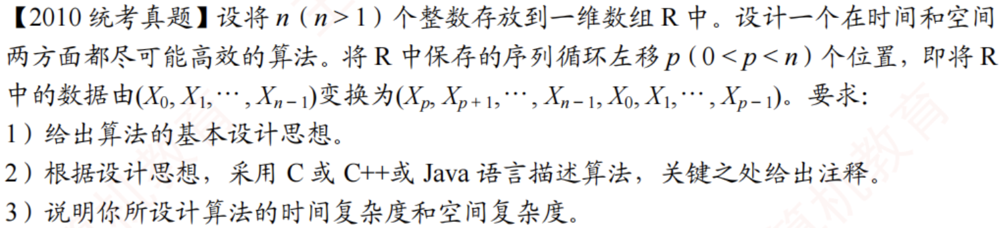

# 2010真题：线性表两段互换

#中等 #线性表 #顺序表 #反转 #考研真题

## 题目信息



将顺序表 `R` 中的前 `p` 个元素与后面的 `n-p` 个元素整体互换，要求尽可能高效，并保持各段内部的相对顺序。例如 `R = (a,b,c,d,e)`、`p=2` 时，结果为 `(c,d,e,a,b)`。

## 示例

把数组看成两段 `ab`，其中 `a` 是前 `p` 个元素，`b` 是剩余元素。目标是把 `ab` 变为 `ba`。

## 直接解：使用辅助数组复制

先把后半段复制到辅助数组，再依次写回前半段和后半段。该方法容易理解，但需要与表长成正比的额外空间。

```c
void converseDirect(int R[], int n, int p, int temp[]) {
    int i;

    for (i = p; i < n; i++) {
        temp[i - p] = R[i];
    }
    for (i = 0; i < p; i++) {
        temp[n - p + i] = R[i];
    }
    for (i = 0; i < n; i++) {
        R[i] = temp[i];
    }
}
```

时间复杂度为 `O(n)`，额外空间复杂度为 `O(n)`。

## 优化解：三次逆置原地交换

先逆置前段 `a`，再逆置后段 `b`，最后逆置整体。得到：

`ab → aᵀb → aᵀbᵀ → (aᵀbᵀ)ᵀ = ba`

整个过程中只使用临时交换变量，不需要辅助数组。

## 示例推演

以 `R=(a,b,c,d,e)`、`p=2` 为例：先得到 `(b,a,c,d,e)`，再得到 `(b,a,e,d,c)`，最后整体逆置为 `(c,d,e,a,b)`。

## 代码实现

```c
void reverse(int R[], int from, int to) {
    int i;
    int temp;

    for (i = 0; i < (to - from + 1) / 2; i++) {
        temp = R[from + i];
        R[from + i] = R[to - i];
        R[to - i] = temp;
    }
}

void converse(int R[], int n, int p) {
    if (p <= 0 || p >= n) {
        return;
    }
    reverse(R, 0, p - 1);
    reverse(R, p, n - 1);
    reverse(R, 0, n - 1);
}
```

## 正确性说明

逆置两段后得到 `aᵀbᵀ`，再对整体逆置时，整体逆置会分别恢复每段内部顺序，同时交换两段的相对位置，因此结果为 `ba`。

## 复杂度分析

- **时间复杂度：** `O(n)`，三次逆置的总操作次数与 `n` 成正比。
- **空间复杂度：** `O(1)`，只使用常数个临时变量。

## 易错点

1. `p` 必须满足 `0 < p < n`，否则不需要交换或输入无效。
2. 逆置循环条件应使用小于号，避免奇数长度时重复交换中间元素。
3. C 语言数组下标从 `0` 开始，第二段起点是 `p`。
