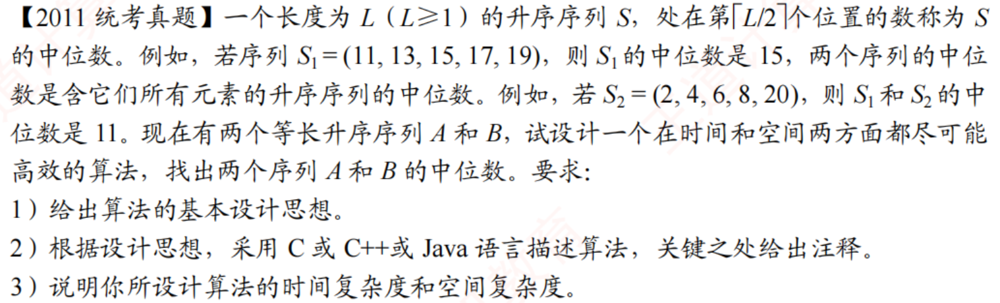

# 2011真题：两个等长升序序列的中位数

#中等 #线性表 #顺序表 #分治 #中位数 #考研真题

## 题目信息



给定两个长度相等的升序序列 $A$ 和 $B$，要求找出合并后升序序列的中位数。题目将长度为 $L$ 的序列中第 $\lceil L/2 \rceil$ 个元素定义为中位数，因此合并后的 $2n$ 个元素需要寻找第 $n$ 小的元素，也就是下中位数。

## 示例

设：

```text
A = (11, 13, 15, 17, 19)
B = (2, 4, 6, 8, 20)
```

合并并排序后为：

```text
(2, 4, 6, 8, 11, 13, 15, 17, 19, 20)
```

第 $5$ 个元素是 $11$，所以两个序列的中位数是 $11$。

## 直接解：归并到第 n 个元素

用两个指针分别扫描 `A` 和 `B`，每次取较小者，取出第 `n` 个元素后停止。它不必真的保存合并结果，但最坏需要扫描 `O(n)` 个元素。

```c
int medianBrute(int A[], int B[], int n) {
    int i = 0, j = 0, k = 0, value = 0;

    while (k < n) {
        if (i < n && (j >= n || A[i] <= B[j])) {
            value = A[i++];
        } else {
            value = B[j++];
        }
        k++;
    }
    return value;
}
```

时间复杂度为 `O(n)`，空间复杂度为 `O(1)`；若保存完整合并序列，则额外空间为 `O(n)`。

## 优化解：缩小等长候选区间

直接合并两个序列需要 $O(n)$ 的时间和 $O(n)$ 的额外空间。由于两个序列已经有序，可以采用类似二分查找的思想，每轮比较两个候选区间的中位数，并排除不可能包含答案的两段元素。

使用 $s_1,d_1$ 表示序列 $A$ 的候选区间，使用 $s_2,d_2$ 表示序列 $B$ 的候选区间。算法始终保证两个候选区间长度相等。

设两个候选区间的中点分别为 $m_1$ 和 $m_2$：

- 若 $A[m_1]=B[m_2]$，该元素就是所求中位数。
- 若 $A[m_1]<B[m_2]$，排除 $A$ 的较小部分和 $B$ 的较大部分。
- 若 $A[m_1]>B[m_2]$，排除 $A$ 的较大部分和 $B$ 的较小部分。

每次必须从两侧排除相同数量的元素，才能保持目标元素在剩余集合中的秩不变。候选区间长度为奇数和偶数时，中点是否保留有所不同。

### 区间长度为奇数

若 $A[m_1]<B[m_2]$，保留 $A[m_1\dots d_1]$ 与 $B[s_2\dots m_2]$；反之，保留 $A[s_1\dots m_1]$ 与 $B[m_2\dots d_2]$。两个中点都需要保留。

### 区间长度为偶数

代码使用靠左的元素作为中点。若 $A[m_1]<B[m_2]$，保留 $A[m_1+1\dots d_1]$ 与 $B[s_2\dots m_2]$；反之，保留 $A[s_1\dots m_1]$ 与 $B[m_2+1\dots d_2]$。

当两个候选区间都只剩一个元素时，取二者较小值。因为此时剩余集合只有两个元素，而题目要求的是下中位数。

## 示例推演

以上面的两个序列为例：

| 轮次 | $A$ 的候选区间 | $B$ 的候选区间 | 中点比较 | 保留结果 |
| --- | --- | --- | --- | --- |
| 1 | $(11,13,15,17,19)$ | $(2,4,6,8,20)$ | $15>6$ | $A=(11,13,15)$，$B=(6,8,20)$ |
| 2 | $(11,13,15)$ | $(6,8,20)$ | $13>8$ | $A=(11,13)$，$B=(8,20)$ |
| 3 | $(11,13)$ | $(8,20)$ | $11>8$ | $A=(11)$，$B=(20)$ |

最终返回 $\min(11,20)=11$。

## 代码实现

题目已保证两个序列等长且长度 $n\geq 1$，因此答题时直接把这些条件作为算法的前置条件，无需加入异常处理。

```c
int M_Search(int A[], int B[], int n) {
    int s1 = 0, d1 = n - 1, m1;
    int s2 = 0, d2 = n - 1, m2;

    while (s1 != d1) {
        m1 = (s1 + d1) / 2;
        m2 = (s2 + d2) / 2;

        if (A[m1] == B[m2])
            return A[m1];

        if (A[m1] < B[m2]) {
            if ((s1 + d1) % 2 == 0) {
                // 元素个数为奇数，两个中点均保留
                s1 = m1;
                d2 = m2;
            } else {
                // 元素个数为偶数，舍弃 A 的中点
                s1 = m1 + 1;
                d2 = m2;
            }
        } else {
            if ((s2 + d2) % 2 == 0) {
                // 元素个数为奇数，两个中点均保留
                d1 = m1;
                s2 = m2;
            } else {
                // 元素个数为偶数，舍弃 B 的中点
                d1 = m1;
                s2 = m2 + 1;
            }
        }
    }

    return A[s1] < B[s2] ? A[s1] : B[s2];
}
```

其中，候选区间的元素个数为 $d_1-s_1+1$。当 $(s_1+d_1)$ 为偶数时，区间长度为奇数；反之，区间长度为偶数。序列 $A$ 和 $B$ 的候选区间始终等长，因此判断任意一个区间即可。

## 正确性说明

算法维护如下不变式：两个候选区间始终等长，并且原问题的中位数等于两个候选区间合并后的中位数。

当两个中点不相等时，较小中点一侧的低值元素不可能越过目标秩，较大中点一侧的高值元素也不可能成为目标。算法从低端和高端排除相同数量的元素，因此目标元素在剩余集合中的相对秩不变。

每轮操作后，两个候选区间仍然等长，不变式继续成立。区间长度最终缩小为 $1$，此时两个剩余元素中的较小值就是合并后两个元素的下中位数，因此算法返回正确结果。

## 复杂度分析

每轮都将候选区间长度缩小约一半，所以循环执行 $O(\log n)$ 次。每轮只进行常数次比较和下标修改。

- **时间复杂度：$O(\log n)$**
- **空间复杂度：$O(1)$**

算法只维护若干下标，没有复制或合并原序列。
