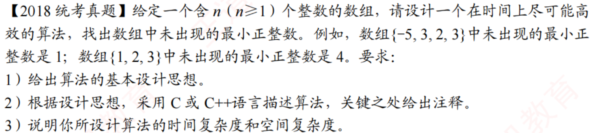

# 2018真题：未出现的最小正整数

#中等 #数组 #原地算法 #置换

## 题目信息



给定一个包含 $n$ 个整数的数组，要求在线性时间内找出数组中没有出现的最小正整数，并且只使用常数级额外空间。

## 示例

```text
A = (-5, 3, 2, 3)
```

正整数 $1$ 没有出现在数组中，所以答案是 $1$。

```text
A = (1, 2, 3)
```

正整数 $1$、$2$、$3$ 都出现了，所以答案是 $4$。

## 算法设计思路

数组长度为 $n$ 时，答案一定在 $1$ 到 $n+1$ 之间。因为如果 $1$ 到 $n$ 都出现，数组中最多只有 $n$ 个元素，最小缺失正整数只能是 $n+1$。

因此只需要关注数组中的 $1$ 到 $n$。将数值 $x$ 放到下标 $x-1$ 的位置：

- 数值不在 $[1,n]$ 中时，它不会影响答案，直接跳过。
- 数值在 $[1,n]$ 中时，将它交换到对应位置。
- 如果目标位置已经存放相同的数，直接跳过，避免重复数字造成死循环。

完成整理后，从左到右检查数组。第一个不满足 $A[i]=i+1$ 的位置，对应的答案就是 $i+1$；如果所有位置都满足，则答案为 $n+1$。

## 示例推演

对于数组：

```text
A = (-5, 3, 2, 3)
```

将数字 $3$ 放到下标 $2$ 的位置，将数字 $2$ 放到下标 $1$ 的位置，整理后可以得到：

```text
(-5, 2, 3, 3)
```

检查下标 $0$ 时，应该出现的数字是 $1$，但 $A[0]\ne 1$，因此答案为 $1$。

## 代码实现

题目已保证 $n\geq 1$。下面使用数组自身作为标记空间，不引入辅助数组或标准库。

```c
int findMissMin(int A[], int n) {
    int i, temp;

    i = 0;
    while (i < n) {
        /*
         * A[i] 在 [1,n] 内时，尝试把它放到下标 A[i]-1 的位置。
         * 目标位置已是相同数字时跳过，避免重复元素导致死循环。
         */
        if (A[i] >= 1 && A[i] <= n && A[i] != A[A[i] - 1]) {
            temp = A[i];
            A[i] = A[temp - 1];
            A[temp - 1] = temp;
        } else {
            i++;
        }
    }

    for (i = 0; i < n; i++) {
        if (A[i] != i + 1)
            return i + 1;
    }

    return n + 1;
}
```

## 正确性说明

算法结束时，所有能够放入对应位置的数字 $x\in[1,n]$ 都被放在下标 $x-1$ 处。数组中的负数、零以及大于 $n$ 的数不可能成为最小缺失正整数，因此可以忽略。

从下标 $0$ 开始检查时，如果 $A[i]\ne i+1$，说明正整数 $i+1$ 没有出现在数组中；由于更小的正整数都已经位于对应位置，$i+1$ 就是最小缺失正整数。如果所有位置都匹配，则 $1$ 到 $n$ 全部出现，答案为 $n+1$。

## 复杂度分析

每个有效数字最多被交换到自己的目标位置，整理和扫描都只需要线性时间。

- **时间复杂度：$O(n)$**
- **空间复杂度：$O(1)$**

算法直接修改原数组，不使用与 $n$ 成正比的额外空间。
