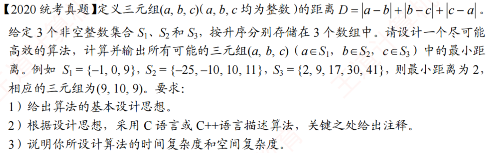

# 2020真题：三个有序集合的最小距离

#中等 #数组 #双指针 #贪心

## 题目信息



给定三个非空整数集合 $S_1$、$S_2$ 和 $S_3$，三个集合中的元素分别按升序存储在三个数组中。从三个数组中各取一个元素组成三元组 $(a,b,c)$，要求找出所有可能三元组中的最小距离。

三元组距离定义为：

$$D=|a-b|+|b-c|+|c-a|$$

## 示例

```text
S1 = (-1, 0, 9)
S2 = (-25, -10, 10, 11)
S3 = (2, 9, 17, 30, 41)
```

当取三元组 $(9,10,9)$ 时，距离为：

```text
|9-10| + |10-9| + |9-9| = 2
```

所以最小距离为 $2$。

## 算法设计思路

设当前三元组中的最小值为 $min$，最大值为 $max$。由于三个数已经有序，不论三个数的排列顺序如何，都有：

$$|a-b|+|b-c|+|c-a|=2(max-min)$$

因此问题转化为尽量缩小当前三元组的最大值与最小值之差。

使用三个指针 $i$、$j$、$k$ 分别指向三个数组的当前元素：

1. 计算当前三元组的距离，并更新最优答案。
2. 找出当前三个元素中的最小值。
3. 只有移动最小值所在数组的指针，才可能让下一组三元组的区间变小。
4. 如果多个数组同时取得最小值，则同步移动这些数组的指针。

当任意一个指针越过数组末尾时，后续无法组成完整三元组，算法结束。

## 示例推演

初始指针指向 $(-1,-25,2)$，当前最小值为 $-25$，最大值为 $2$。此时应移动第二个数组的指针。

随着指针移动，三元组的取值区间不断缩小。当指针指向 $(9,10,9)$ 时，最大值和最小值之差为 $1$，所以距离为 $2$，得到最优答案。

## 代码实现

题目已保证三个数组均非空且有序。函数通过指针参数输出一个达到最小距离的三元组；如果存在多个最优三元组，返回其中一个即可。

```c
int tripleDistance(int a, int b, int c) {
    int maxValue = a;
    int minValue = a;

    if (b > maxValue) maxValue = b;
    if (c > maxValue) maxValue = c;
    if (b < minValue) minValue = b;
    if (c < minValue) minValue = c;

    return 2 * (maxValue - minValue);
}

void findMinDistance(
    int A[], int n1, int B[], int n2, int C[], int n3,
    int *minA, int *minB, int *minC, int *minD
) {
    int i = 0, j = 0, k = 0;
    int a, b, c, currentD;
    int minValue;

    *minA = A[0];
    *minB = B[0];
    *minC = C[0];
    *minD = tripleDistance(A[0], B[0], C[0]);

    while (i < n1 && j < n2 && k < n3) {
        a = A[i];
        b = B[j];
        c = C[k];
        currentD = tripleDistance(a, b, c);

        if (currentD < *minD) {
            *minD = currentD;
            *minA = a;
            *minB = b;
            *minC = c;
        }

        minValue = a;
        if (b < minValue) minValue = b;
        if (c < minValue) minValue = c;

        /* 移动所有等于最小值的指针，继续寻找更小的区间。 */
        if (a == minValue) i++;
        if (b == minValue) j++;
        if (c == minValue) k++;
    }
}
```

## 正确性说明

当前三元组的距离只由最大值和最小值决定。若当前最小值所在的指针不移动，下一组三元组仍然包含这个最小值，最大值只可能增大或不变，距离不可能得到改善。因此移动最小值所在指针不会遗漏更优解。

三个数组均有序，指针只向右移动。算法会检查所有可能成为区间下界的状态，并在每个状态记录距离最小的三元组，所以最终得到的就是全局最小距离。

## 复杂度分析

每个指针最多移动到对应数组末尾一次，三重循环没有嵌套扫描，因此总移动次数为 $O(n_1+n_2+n_3)$。

- **时间复杂度：$O(n_1+n_2+n_3)$**
- **空间复杂度：$O(1)$**

算法只使用三个指针和常数个临时变量。
