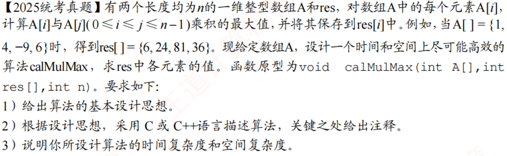

# 2025真题：数组后缀的最大乘积

#中等 #数组 #动态规划 #后缀 #考研真题

## 题目信息



给定长度为 $n$ 的整数数组 $A$ 和 $res$。对于每个下标 $i$，计算所有满足 $i\leq j\leq n-1$ 的乘积 $A[i]\times A[j]$ 中的最大值，并将结果保存到 $res[i]$ 中。

函数原型为：

```c
void calMulMax(int A[], int res[], int n);
```

## 示例

```text
A   = (1, 4, -9, 6)
res = (6, 24, 81, 36)
```

例如：

- $res[0]=\max(1\times1,1\times4,1\times(-9),1\times6)=6$
- $res[2]=\max((-9)\times(-9),(-9)\times6)=81$
- $res[3]=6\times6=36$

## 直接解：枚举后缀中的所有搭配

对每个 `i`，枚举所有 `j>=i`，计算 `A[i]*A[j]` 的最大值。它直接对应题意，适合用来验证优化算法。

```c
void calMulMaxBrute(int A[], int res[], int n) {
    int i, j;

    for (i = 0; i < n; i++) {
        res[i] = A[i] * A[i];
        for (j = i + 1; j < n; j++) {
            int product = A[i] * A[j];
            if (product > res[i]) {
                res[i] = product;
            }
        }
    }
}
```

时间复杂度为 `O(n²)`，空间复杂度为 `O(1)`。

## 优化解：维护后缀最大值和最小值

对于固定的 $A[i]$，只需要知道后缀 $A[i\dots n-1]$ 中的最大值和最小值：

- 当 $A[i]$ 为正数时，最大乘积来自后缀最大值。
- 当 $A[i]$ 为负数时，最大乘积来自后缀最小值。
- 当 $A[i]=0$ 时，乘积为 $0$。

因此从右向左扫描数组，维护当前后缀的最大值 `maxValue` 和最小值 `minValue`。将 $A[i]$ 加入后缀后，比较：

$$A[i]\times maxValue$$

和：

$$A[i]\times minValue$$

二者的较大值就是 $res[i]$。计算完成后继续向左扩展后缀。

## 示例推演

从右向左处理：

| 下标 | 当前后缀 | 后缀最小值 | 后缀最大值 | 结果 |
| --- | --- | --- | --- | --- |
| 3 | $(6)$ | $6$ | $6$ | $36$ |
| 2 | $(-9,6)$ | $-9$ | $6$ | $81$ |
| 1 | $(4,-9,6)$ | $-9$ | $6$ | $24$ |
| 0 | $(1,4,-9,6)$ | $-9$ | $6$ | $6$ |

最终得到 `res = (6, 24, 81, 36)`。

## 代码实现

题目已保证数组长度有效，并默认题目给定范围内的乘积可以用 `int` 表示。算法不使用辅助数组。

```c
void calMulMax(int A[], int res[], int n) {
    int i;
    int maxValue = A[n - 1];
    int minValue = A[n - 1];
    int product1, product2;

    res[n - 1] = A[n - 1] * A[n - 1];

    for (i = n - 2; i >= 0; i--) {
        /* 先把 A[i] 加入当前后缀。 */
        if (A[i] > maxValue) maxValue = A[i];
        if (A[i] < minValue) minValue = A[i];

        product1 = A[i] * maxValue;
        product2 = A[i] * minValue;
        res[i] = product1 > product2 ? product1 : product2;
    }
}
```

## 正确性说明

处理下标 $i$ 时，`maxValue` 和 `minValue` 分别保存后缀 $A[i\dots n-1]$ 的最大值和最小值。任意后缀元素都位于这两个值之间：

- $A[i]\geq 0$ 时，与最大值相乘得到最大乘积。
- $A[i]<0$ 时，与最小值相乘得到最大乘积。

所以最大乘积一定等于 `product1` 和 `product2` 中的较大值。处理完 $i$ 后，维护的最大值和最小值又恰好对应下一个更长的后缀，循环结束时所有 `res[i]` 都正确。

## 复杂度分析

数组只从右向左扫描一次，每个位置进行常数次比较和乘法。

- **时间复杂度：$O(n)$**
- **空间复杂度：$O(1)$**

结果直接写入题目给定的 `res` 数组，不计入额外辅助空间。
