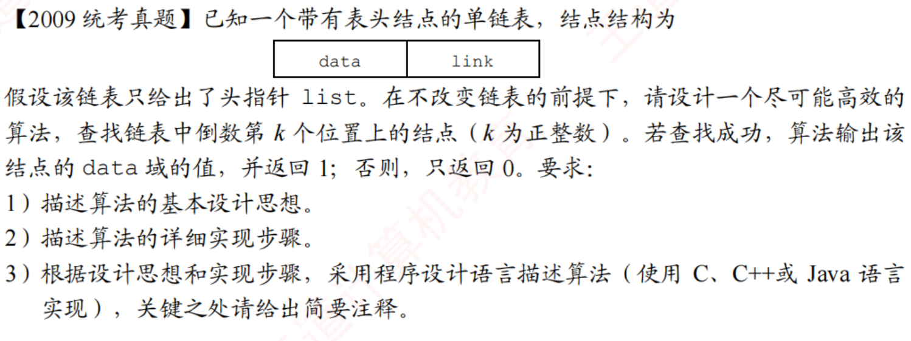

# 2009真题：查找链表倒数第k个结点

#中等 #链表 #双指针 #查找 #考研真题

## 题目信息



已知一个带有表头结点的单链表，结点结构为 `data` 和 `link`，只给出头指针 `list`。请设计尽可能高效的算法，查找链表中倒数第 `k` 个位置的结点。若找到，输出该结点的 `data` 并返回 `1`；否则返回 `0`。

题目不允许改变链表，因此算法只能通过指针遍历完成。这里将 `list` 视为指向首个数据结点的指针；如果实际代码中的 `list` 指向头结点，只需先令 `list = list->link`。

## 示例

链表为 `1->2->3->4->5`，当 `k=2` 时，倒数第 `2` 个结点是 `4`；当 `k=6` 时查找失败。

## 直接解：先求长度，再定位

先遍历链表求出数据结点个数 `n`。如果 `k <= 0` 或 `k > n`，查找失败；否则从表头再次出发，走到第 `n-k+1` 个结点。

这种方法思路直接、容易验证，代价是需要完整遍历一次，再从头走到目标位置。

```c
typedef struct LNode {
    int data;
    struct LNode *link;
} LNode, *LinkList;

int findKthFromEndTwoPass(LinkList list, int k, int *value) {
    LinkList p;
    int n = 0;
    int i;

    if (k <= 0) {
        return 0;
    }

    for (p = list; p != NULL; p = p->link) {
        n++;
    }
    if (k > n) {
        return 0;
    }

    p = list;
    for (i = 1; i < n - k + 1; i++) {
        p = p->link;
    }
    *value = p->data;
    return 1;
}
```

时间复杂度为 `O(n)`，空间复杂度为 `O(1)`。

## 优化解：快慢指针一次扫描

让 `fast` 先向前走 `k` 步，再让 `fast` 和 `slow` 同步向后移动。当 `fast` 到达表尾时，`slow` 恰好指向倒数第 `k` 个结点。

如果 `fast` 不足 `k` 步就到达 `NULL`，说明链表长度小于 `k`。该方法不需要保存长度，也不需要第二次从表头定位。

```c
int findKthFromEnd(LinkList list, int k, int *value) {
    LinkList fast = list;
    LinkList slow = list;
    int i;

    if (k <= 0) {
        return 0;
    }

    for (i = 0; i < k; i++) {
        if (fast == NULL) {
            return 0;
        }
        fast = fast->link;
    }

    while (fast != NULL) {
        fast = fast->link;
        slow = slow->link;
    }

    *value = slow->data;
    return 1;
}
```

时间复杂度仍为 `O(n)`，但只需一次连续扫描；空间复杂度为 `O(1)`。

## 示例推演

令 `k=2`，快指针先前进两步到 `3`。随后快慢指针同步移动：快指针到 `5` 时慢指针到 `4`，快指针到 `NULL` 时慢指针仍指向 `4`。

## 代码实现

直接解和快慢指针优化解的完整 C 代码已分别放在对应解法下；考试中优先书写快慢指针版本。

## 易错点

1. `k` 从 `1` 开始计数，`k=1` 表示最后一个数据结点。
2. 判断是否存在第 `k` 个结点时，必须在快指针每次前进前检查空指针。
3. 比较的是结点位置，不是 `data` 值；链表中允许出现相同数据。
