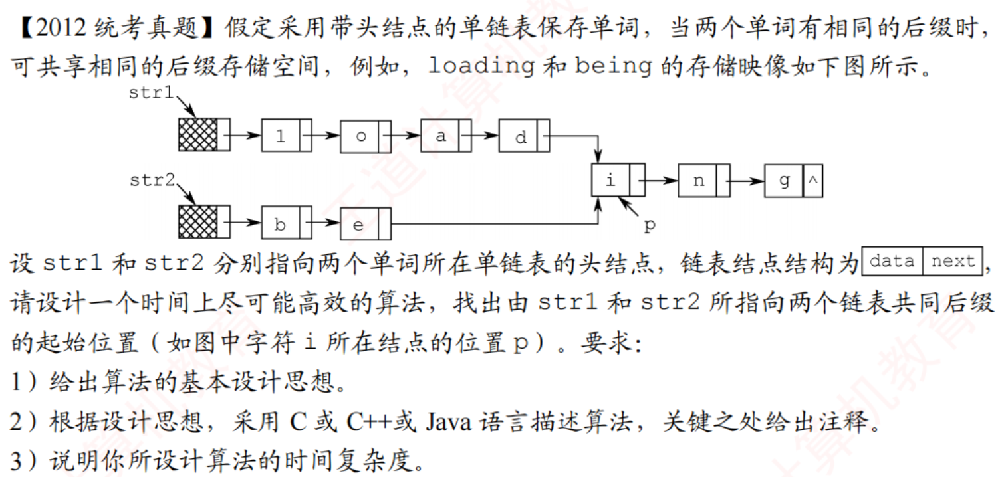

# 2012真题：两个链表的公共后缀起点

#中等 #链表 #双指针 #公共后缀 #考研真题

## 题目信息

两个单词分别由带头结点的单链表保存，两个链表可能共享一段后缀。给出 `str1` 和 `str2` 指向的首个数据结点，要求找出两个链表公共后缀的起始结点。

这里的“公共”指两个指针指向同一个结点地址，而不是两个结点的 `data` 恰好相等。若没有公共后缀，返回 `NULL`。

## 直接解：逐结点比较地址

依次取出第一个链表的每个结点，再从第二个链表头开始扫描。如果发现两个指针相等，就找到了公共后缀起点。

```c
typedef struct LNode {
    char data;
    struct LNode *next;
} LNode, *LinkList;

LinkList findCommonNodeBrute(LinkList str1, LinkList str2) {
    LinkList p;
    LinkList q;

    for (p = str1; p != NULL; p = p->next) {
        for (q = str2; q != NULL; q = q->next) {
            if (p == q) {
                return p;
            }
        }
    }
    return NULL;
}
```

设两个链表长度分别为 `m` 和 `n`，最坏时间复杂度为 `O(mn)`，空间复杂度为 `O(1)`。

## 优化解：长度对齐后同步比较

如果两个链表存在公共后缀，那么从公共起点开始直到尾结点的指针序列完全相同，因此两个链表的尾指针必须相同。先求长度和尾指针，尾指针不同即可直接判定没有公共后缀。

之后让较长链表的指针先走过长度差，使两个指针到尾部的距离相同，再同步向后移动，第一次相等的位置就是公共后缀起点。

```c
int getLengthAndTail(LinkList list, LinkList *tail) {
    int length = 0;
    LinkList p = list;

    *tail = NULL;
    while (p != NULL) {
        *tail = p;
        p = p->next;
        length++;
    }
    return length;
}

LinkList findCommonNode(LinkList str1, LinkList str2) {
    LinkList tail1;
    LinkList tail2;
    LinkList p = str1;
    LinkList q = str2;
    int len1 = getLengthAndTail(str1, &tail1);
    int len2 = getLengthAndTail(str2, &tail2);
    int diff;

    if (tail1 == NULL || tail1 != tail2) {
        return NULL;
    }

    diff = len1 - len2;
    if (diff > 0) {
        while (diff-- > 0) {
            p = p->next;
        }
    } else {
        diff = -diff;
        while (diff-- > 0) {
            q = q->next;
        }
    }

    while (p != q) {
        p = p->next;
        q = q->next;
    }
    return p;
}
```

时间复杂度为 `O(m+n)`，空间复杂度为 `O(1)`。

## 易错点

1. 必须比较 `p == q`，不能比较 `p->data == q->data`。
2. 公共部分必然从某个结点开始一直共享到尾部，所以尾指针不同可以直接排除。
3. 对齐的是“到尾部的距离”，不是简单让两个指针从相同下标开始。

## 题图



