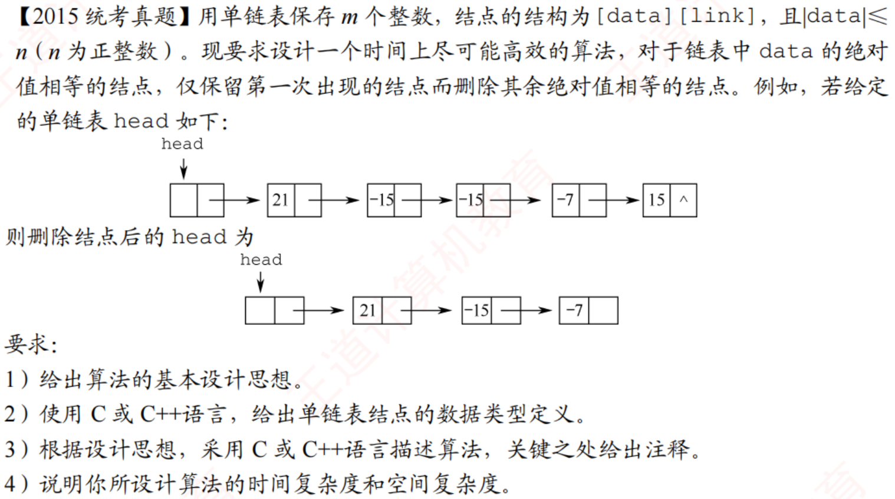

# 2015真题：删除绝对值相等的重复结点

#中等 #链表 #去重 #哈希思想 #考研真题

## 题目信息

单链表保存 `m` 个整数，且每个结点满足 `|data| <= n`。要求只保留绝对值第一次出现的结点，删除后续绝对值相等的结点，并保持剩余结点的相对顺序不变。

例如 `21, -15, -15, -7, 15` 删除后为 `21, -15, -7`。负号不影响“是否重复”，但第一次出现的原始数据仍然保留。

## 直接解：扫描前驱结点

从第二个数据结点开始处理。对当前结点 `p`，扫描它之前已经保留的结点；若找到绝对值相同的结点，就通过前驱指针删除 `p`，否则保留它。

```c
typedef struct NODE {
    int data;
    struct NODE *link;
} NODE;

int absValue(int x) {
    return x < 0 ? -x : x;
}

void deleteDuplicateBrute(NODE *head) {
    NODE *pre = head;
    NODE *p = head->link;

    while (p != NULL) {
        NODE *q = head->link;
        int repeated = 0;

        while (q != p) {
            if (absValue(q->data) == absValue(p->data)) {
                repeated = 1;
                break;
            }
            q = q->link;
        }

        if (repeated) {
            pre->link = p->link;
            p = pre->link;
        } else {
            pre = p;
            p = p->link;
        }
    }
}
```

时间复杂度为 `O(m²)`，空间复杂度为 `O(1)`。代码只改变链接，不改变结点中保存的数据。

## 优化解：利用绝对值范围建立标记表

题目给出了 `|data| <= n`，可以建立长度为 `n+1` 的标记表，`seen[x]` 表示绝对值 `x` 是否已经出现。每个结点只需查表一次，因此不再扫描前面的结点。

```c
void deleteDuplicate(NODE *head, int n) {
    int seen[n + 1];
    NODE *pre = head;
    NODE *p = head->link;
    int i;

    for (i = 0; i <= n; i++) {
        seen[i] = 0;
    }

    while (p != NULL) {
        int value = absValue(p->data);

        if (seen[value]) {
            pre->link = p->link;
            p = pre->link;
        } else {
            seen[value] = 1;
            pre = p;
            p = p->link;
        }
    }
}
```

这是 C99 变长数组写法，突出考研算法中的空间模型；若编译器不支持 VLA，可将 `seen` 改为调用者提供的 `n+1` 长度数组。时间复杂度为 `O(m+n)`，空间复杂度为 `O(n)`。

## 易错点

1. `21` 和 `-21` 算重复，但应保留先出现的原结点。
2. 删除当前结点后，`pre` 不能前移；否则可能跳过连续重复结点。
3. 本题给出的数值范围正是优化的关键条件，不能忽略。

## 题图



