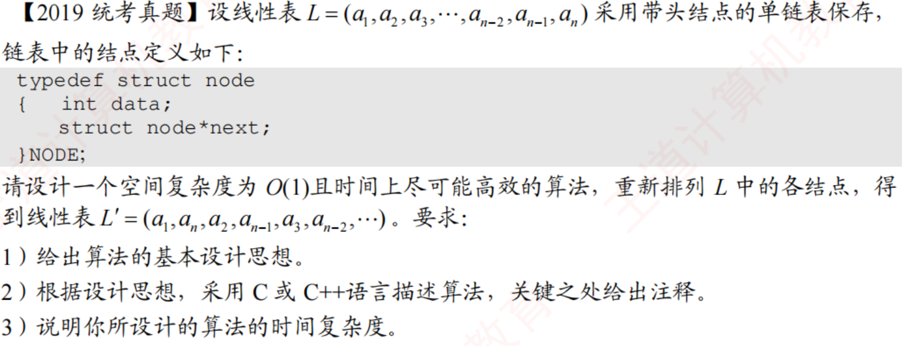

# 2019真题：单链表交替重排

#困难 #链表 #反转 #双指针 #考研真题

## 题目信息



带头结点的单链表为 `L=(a1,a2,...,an)`，要求在空间复杂度为 `O(1)` 的条件下，将它重排为：

`L'=(a1,an,a2,a(n-1),a3,a(n-2),...)`。

只能调整结点链接，不能复制结点或修改数据。

## 直接解：数组保存结点指针

先遍历链表，把每个数据结点的地址依次放入数组。然后使用左右两个下标，交替取左端和右端结点重新连接。

```c
typedef struct node {
    int data;
    struct node *next;
} NODE;

void reorderByArray(NODE *head, int n) {
    NODE *nodes[n];
    NODE *p = head->next;
    NODE *tail = head;
    int i = 0;
    int left = 0;
    int right;

    while (p != NULL) {
        nodes[i++] = p;
        p = p->next;
    }
    right = i - 1;

    while (left <= right) {
        tail->next = nodes[left++];
        tail = tail->next;
        if (left <= right) {
            tail->next = nodes[right--];
            tail = tail->next;
        }
    }
    tail->next = NULL;
}
```

时间复杂度为 `O(n)`，但需要保存 `n` 个结点指针，空间复杂度为 `O(n)`。它适合先验证重排顺序，也是理解原地解的基线。

## 优化解：找中点、逆置后半段、交替合并

把链表拆成前后两段：前半段保持顺序，后半段逆置。逆置后，后半段的顺序正好是 `an,a(n-1),...`，最后交替合并两段即可。

```c
void reorderList(NODE *head) {
    NODE *slow = head->next;
    NODE *fast = head->next;
    NODE *second;
    NODE *prev = NULL;
    NODE *first;

    if (slow == NULL || slow->next == NULL) {
        return;
    }

    while (fast != NULL && fast->next != NULL) {
        slow = slow->next;
        fast = fast->next->next;
    }

    second = slow->next;
    slow->next = NULL;

    while (second != NULL) {
        NODE *next = second->next;
        second->next = prev;
        prev = second;
        second = next;
    }

    first = head->next;
    second = prev;
    while (second != NULL) {
        NODE *nextFirst = first->next;
        NODE *nextSecond = second->next;

        first->next = second;
        second->next = nextFirst;
        first = nextFirst;
        second = nextSecond;
    }
}
```

找中点、逆置和合并都只遍历链表常数次，因此时间复杂度为 `O(n)`，只使用若干指针，空间复杂度为 `O(1)`。

## 易错点

1. 切断前半段与后半段的连接，避免逆置或合并时形成环。
2. 奇数长度时，中点结点属于前半段；偶数长度时，前半段多一个结点也不会影响结果。
3. 合并时必须先保存两个后继指针，否则原链表的剩余部分会丢失。
