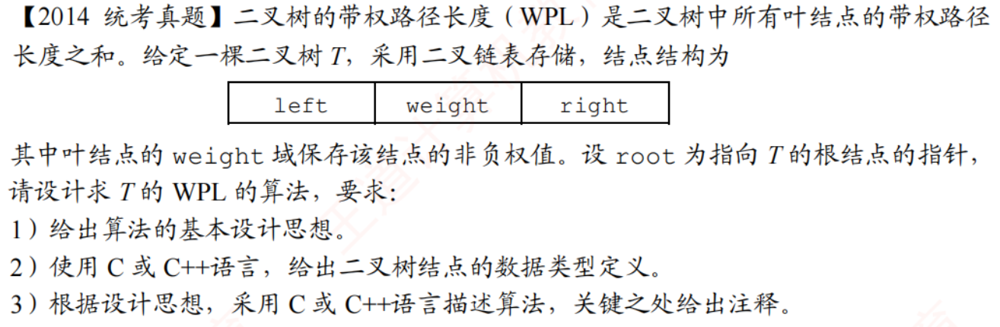

# 2014真题：二叉树的带权路径长度

#中等 #二叉树 #递归 #树的遍历 #考研真题

## 题目信息



二叉树的带权路径长度（WPL）是所有叶结点的带权路径长度之和。给定一棵采用二叉链表存储的二叉树，叶结点的 `weight` 保存非负权值，要求计算整棵树的 WPL。

根结点到自身的路径长度为 `0`。因此，若根结点本身就是叶结点，它对 WPL 的贡献为 `weight * 0 = 0`。

## 直接解：递归遍历并累加

从根结点出发，同时记录当前结点的深度 `depth`。遇到叶结点时，把 `weight * depth` 加入答案；遇到非叶结点时，递归处理左右子树。

```c
typedef struct BiTNode {
    struct BiTNode *left;
    int weight;
    struct BiTNode *right;
} BiTNode;

int wplRecursive(BiTNode *root, int depth) {
    if (root == NULL) {
        return 0;
    }

    if (root->left == NULL && root->right == NULL) {
        return root->weight * depth;
    }

    return wplRecursive(root->left, depth + 1)
        + wplRecursive(root->right, depth + 1);
}

int getWPL(BiTNode *root) {
    return wplRecursive(root, 0);
}
```

每个结点只访问一次，时间复杂度为 `O(n)`；递归栈最多保存树高，空间复杂度为 `O(h)`。

## 非递归解：遍历时显式保存深度

如果不希望使用递归，可以用栈保存“结点 + 深度”。每次弹出一个元素，叶结点直接累加，非叶结点把非空孩子及其深度压栈。

```c
#define MAX_NODE 1000

typedef struct {
    BiTNode *node;
    int depth;
} StackItem;

int getWPLByStack(BiTNode *root) {
    StackItem stack[MAX_NODE];
    int top = 0;
    int answer = 0;

    if (root == NULL) {
        return 0;
    }
    stack[top].node = root;
    stack[top].depth = 0;
    top++;

    while (top > 0) {
        StackItem current = stack[--top];
        BiTNode *node = current.node;

        if (node->left == NULL && node->right == NULL) {
            answer += node->weight * current.depth;
        } else {
            if (node->right != NULL) {
                stack[top].node = node->right;
                stack[top].depth = current.depth + 1;
                top++;
            }
            if (node->left != NULL) {
                stack[top].node = node->left;
                stack[top].depth = current.depth + 1;
                top++;
            }
        }
    }
    return answer;
}
```

非递归解的时间复杂度仍为 `O(n)`，辅助栈空间为 `O(n)`；若按树高动态管理栈，空间可记为 `O(h)`。它的主要优势是避免递归深度受限，而不是降低渐进时间复杂度。

## 易错点

1. 只有叶结点的 `weight` 参与 WPL，非叶结点的 `weight` 不应累加。
2. 根结点深度从 `0` 开始，不能从 `1` 开始。
3. 不能只统计叶结点权值之和，还必须乘以各自的路径长度。
4. 如果题目没有给出足够大的 `MAX_NODE`，实际答题时应说明栈容量假设或改用动态栈。

