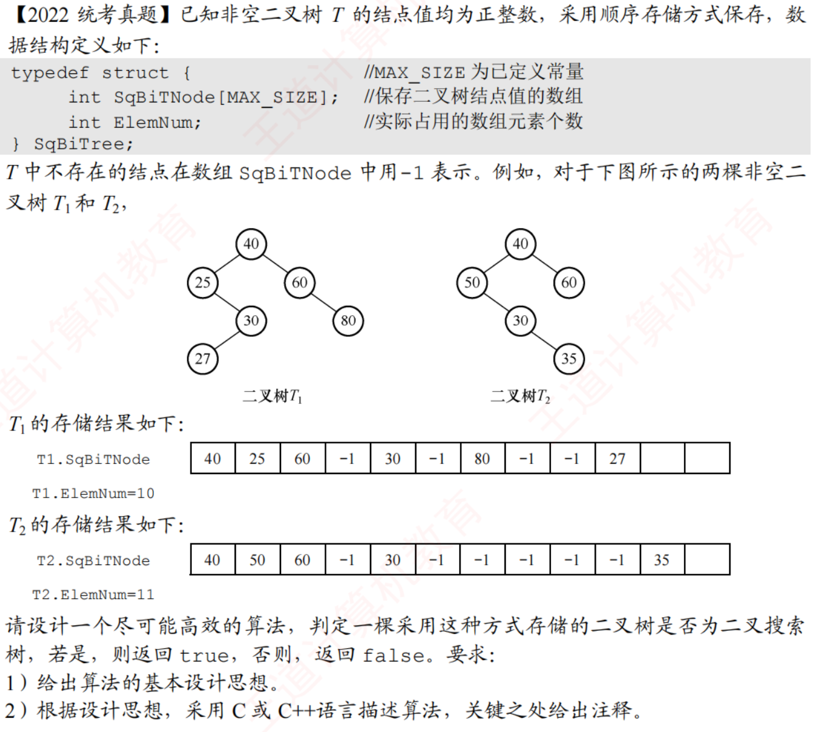

# 2022真题：顺序存储二叉树的二叉搜索树判定

#中等 #二叉树 #二叉搜索树 #顺序存储 #中序遍历 #考研真题

## 题目信息



非空二叉树采用顺序存储。数组 `SqBiTNode` 保存结点值，左孩子下标为 `2*i+1`，右孩子下标为 `2*i+2`；`-1` 表示空位置，`ElemNum` 表示实际使用的数组长度。

要求判断该存储结果表示的二叉树是否为二叉搜索树。本文按严格定义处理：左子树所有结点值小于根，右子树所有结点值大于根。

## 示例

图中的 `T1` 中序遍历为 `27,25,30,40,60,80`，不是递增序列，因此不是二叉搜索树。`T2` 中序遍历为 `50,30,35,40,60`，同样不是二叉搜索树。

## 直接解：中序遍历后检查有序性

二叉搜索树的中序遍历结果必须严格递增。先把所有实际结点写入辅助数组，再检查相邻元素是否满足前者小于后者。

这种方法逻辑直观，适合作为基线解，但会额外保存整棵树的中序序列。

```c
void inorderDirect(const SqBiTree *tree, int index, int order[], int *count) {
    if (index >= tree->ElemNum || tree->SqBiTNode[index] == -1) {
        return;
    }
    inorderDirect(tree, 2 * index + 1, order, count);
    order[(*count)++] = tree->SqBiTNode[index];
    inorderDirect(tree, 2 * index + 2, order, count);
}

int isBSTDirect(const SqBiTree *tree) {
    int order[MAX_SIZE];
    int count = 0;
    int i;

    inorderDirect(tree, 0, order, &count);
    for (i = 1; i < count; i++) {
        if (order[i - 1] >= order[i]) {
            return 0;
        }
    }
    return count > 0;
}
```

## 优化解：递归传递取值范围

对每个结点维护允许出现的开区间。进入左子树时收紧上界，进入右子树时收紧下界；只要当前值越界，就可以立即返回 `0`。

该方法不保存中序数组，且每个实际结点只访问一次。

## 示例推演

以 `T1` 为例，中序遍历先访问 `27`，再访问 `25`。由于 `27 >= 25`，序列不再严格递增，可以判定 `T1` 不是二叉搜索树。

对范围法而言，访问 `27` 时它位于结点 `30` 的左子树，允许范围应为 `(-∞,30)`，因此合法；访问 `25` 时若发现它落在某个祖先收紧后的范围之外，则立即判定失败。

## 代码实现

```c
#define MAX_SIZE 1000

typedef struct {
    int SqBiTNode[MAX_SIZE];
    int ElemNum;
} SqBiTree;

int checkBSTRange(
    const SqBiTree *tree,
    int index,
    int lower,
    int hasLower,
    int upper,
    int hasUpper
) {
    int value;

    if (index >= tree->ElemNum || tree->SqBiTNode[index] == -1) {
        return 1;
    }

    value = tree->SqBiTNode[index];
    if ((hasLower && value <= lower) || (hasUpper && value >= upper)) {
        return 0;
    }

    return checkBSTRange(tree, 2 * index + 1,
                         lower, hasLower, value, 1)
        && checkBSTRange(tree, 2 * index + 2,
                         value, 1, upper, hasUpper);
}

int isBST(const SqBiTree *tree) {
    if (tree->ElemNum <= 0 || tree->SqBiTNode[0] == -1) {
        return 0;
    }
    return checkBSTRange(tree, 0, 0, 0, 0, 0);
}
```

## 正确性说明

根结点没有取值限制。若当前结点值为 `x`，左子树所有结点必须小于 `x`，右子树所有结点必须大于 `x`；同时还要继承祖先结点形成的范围。递归因此检查了每个结点的全部祖先约束，返回 `1` 当且仅当整棵树满足二叉搜索树定义。

## 复杂度分析

- **时间复杂度：** `O(n)`，每个实际结点只访问一次。
- **空间复杂度：** `O(h)`，只使用递归栈，不保存中序序列。

## 易错点

1. 只比较父结点和左右孩子不够，必须传递祖先形成的完整范围。
2. 本文采用严格递增中序序列，重复值不满足定义。
3. 顺序存储下标从 `0` 开始，左右孩子分别是 `2*i+1` 和 `2*i+2`。
4. `-1` 是空位置标记，不能作为实际结点值参与比较。
