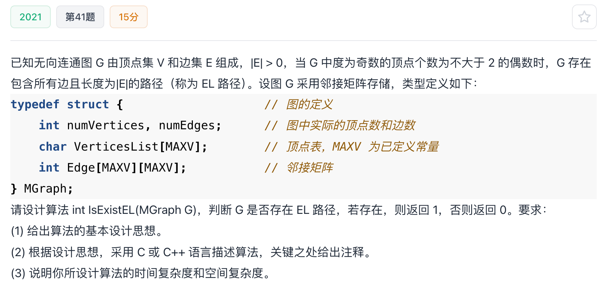

# 2021真题：无向图的欧拉路径判定

#中等 #图 #邻接矩阵 #欧拉路径 #考研真题

## 题目信息



给定无向连通图 `G`，且 `|E| > 0`。当图中度为奇数的顶点个数不超过 `2` 时，图存在包含所有边且每条边恰好经过一次的路径，称为欧拉路径。请判断是否存在欧拉路径。

图已经保证连通，因此只需判断奇度顶点个数。若图不保证连通，还需要额外检查所有非孤立顶点是否属于同一个连通分量。

## 示例

无向图存在欧拉路径的充要条件是奇度顶点数为 `0` 或 `2`：

- `0` 个奇度顶点：存在欧拉回路，也必然存在欧拉路径。
- `2` 个奇度顶点：欧拉路径从一个奇度顶点出发，在另一个奇度顶点结束。
- 超过 `2` 个：不存在欧拉路径。

## 直接解：逐顶点统计度数

邻接矩阵中，顶点 `i` 的度数就是第 `i` 行中非零元素的个数。逐行统计所有顶点的度数，再统计其中的奇数个数，最后判断是否不超过 `2`。

这是矩阵存储下最直接的做法，已经达到读取输入所需的数量级。

## 优化解：发现三个奇度顶点立即结束

欧拉路径最多允许两个奇度顶点。因此统计过程中一旦发现第三个奇度顶点，就可以立即返回 `0`，不再扫描后续顶点。

这种改进只减少部分实际扫描，最坏时间复杂度仍为 `O(|V|^2)`，因为邻接矩阵可能必须整体检查；空间复杂度保持 `O(1)`。

## 示例推演

对每个顶点扫描邻接矩阵的一行，得到其度数并判断奇偶。若前两个奇度顶点已经找到，继续扫描时遇到第三个奇度顶点即可判定失败；若扫描结束只找到 `0` 或 `2` 个，则判定成功。

## 代码实现

```c
#define MAXV 100

typedef struct {
    int numVertices;
    int numEdges;
    char VerticesList[MAXV];
    int Edge[MAXV][MAXV];
} MGraph;

int isExistEL(MGraph G) {
    int i, j;
    int odd = 0;

    for (i = 0; i < G.numVertices; i++) {
        int degree = 0;

        for (j = 0; j < G.numVertices; j++) {
            if (G.Edge[i][j] != 0) {
                degree++;
            }
        }

        if (degree % 2 != 0) {
            odd++;
            if (odd > 2) {
                return 0;
            }
        }
    }
    return 1;
}
```

## 正确性说明

无向连通图存在欧拉路径，当且仅当奇度顶点数为 `0` 或 `2`。代码逐行统计每个顶点的度数，`odd` 正好记录奇度顶点个数。扫描结束时 `odd <= 2`，因此根据充要条件返回正确结果；若中途 `odd > 2`，后续统计不可能使它减少，提前返回同样正确。

## 复杂度分析

- **时间复杂度：** `O(|V|^2)`，最坏需要扫描整个邻接矩阵。
- **空间复杂度：** `O(1)`，只使用常数个计数变量。

## 易错点

1. 本题是无向图，度数应统计一行中的非零边，不要把入度和出度混淆。
2. 奇度顶点数应为 `0` 或 `2`，不是“恰好 2 个”。
3. 结论依赖图连通；若题目不保证连通，必须另行检查连通性。

