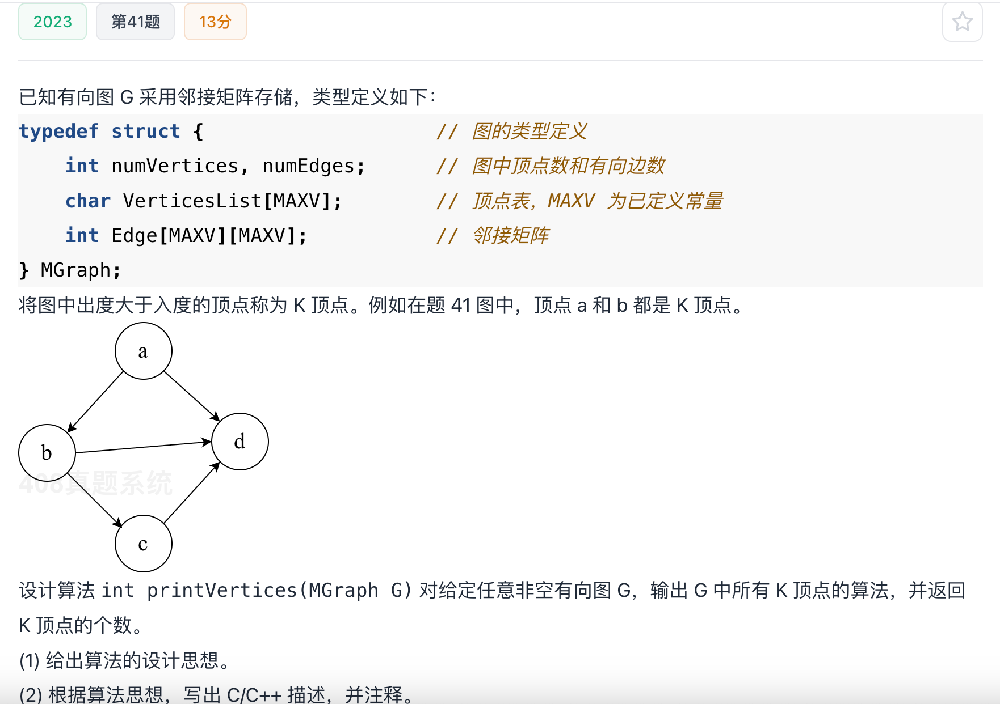

# 2023真题：求有向图中的 K 顶点

#中等 #图 #邻接矩阵 #度 #考研真题

## 题目信息



给定采用邻接矩阵存储的有向图 `G`。若某顶点的出度大于入度，则称它为 K 顶点。请输出图中所有 K 顶点，并返回 K 顶点的个数。

对邻接矩阵而言，第 `i` 行非零元素个数是顶点 `i` 的出度，第 `i` 列非零元素个数是入度。

## 示例

图中顶点 `a` 的出边多于入边，因此它是 K 顶点。顶点 `b`、`c`、`d` 的入出度关系需要按照邻接矩阵逐项统计，不能根据图形位置直接判断。

## 直接解：分别统计入度和出度

对每个顶点分别扫描一行和一列，求出出度与入度后进行比较。该方法最贴合定义，但同一个矩阵位置可能在统计过程中被重复访问。

```c
int printKVerticesDirect(MGraph G) {
    int i, j;
    int count = 0;

    for (i = 0; i < G.numVertices; i++) {
        int outDegree = 0;
        int inDegree = 0;

        for (j = 0; j < G.numVertices; j++) {
            outDegree += G.Edge[i][j] != 0;
            inDegree += G.Edge[j][i] != 0;
        }
        if (outDegree > inDegree) {
            printf("%c ", G.VerticesList[i]);
            count++;
        }
    }
    return count;
}
```

## 优化解：一次扫描同时累计两种度

扫描矩阵元素 `Edge[i][j]` 时，如果存在有向边 `i -> j`，就同时执行 `outDegree[i]++` 和 `inDegree[j]++`。这样一次扫描即可得到全部顶点的入度和出度，再顺序输出满足条件的顶点。

## 示例推演

扫描到边 `i -> j` 时，顶点 `i` 的出度加一，顶点 `j` 的入度加一。矩阵扫描结束后，逐顶点比较 `outDegree[i]` 与 `inDegree[i]`，出度更大的顶点被输出并计数。

## 代码实现

```c
#define MAXV 100

typedef struct {
    int numVertices;
    int numEdges;
    char VerticesList[MAXV];
    int Edge[MAXV][MAXV];
} MGraph;

int printKVertices(MGraph G) {
    int inDegree[MAXV] = {0};
    int outDegree[MAXV] = {0};
    int i, j;
    int count = 0;

    for (i = 0; i < G.numVertices; i++) {
        for (j = 0; j < G.numVertices; j++) {
            if (G.Edge[i][j] != 0) {
                outDegree[i]++;
                inDegree[j]++;
            }
        }
    }

    for (i = 0; i < G.numVertices; i++) {
        if (outDegree[i] > inDegree[i]) {
            printf("%c ", G.VerticesList[i]);
            count++;
        }
    }
    return count;
}
```

## 正确性说明

每条有向边 `i -> j` 恰好使 `i` 的出度增加一次、`j` 的入度增加一次。因此扫描完矩阵后，两个数组分别准确记录每个顶点的出度和入度。代码输出且只输出满足 `outDegree[i] > inDegree[i]` 的顶点，返回值也正好是它们的数量。

## 复杂度分析

- **时间复杂度：** `O(|V|^2)`，需要扫描邻接矩阵并再扫描一次顶点数组。
- **空间复杂度：** `O(|V|)`，保存每个顶点的入度和出度。

## 易错点

1. 有向边 `i -> j` 增加的是 `i` 的出度和 `j` 的入度。
2. K 顶点条件是“出度大于入度”，相等时不能输出。
3. 若题目要求输出顶点编号或字符，应使用 `VerticesList`，不要直接输出数组下标。
