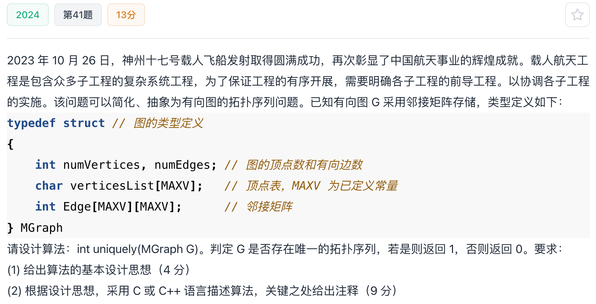

# 2024真题：有向图唯一拓扑序列判定

#中等 #图 #拓扑排序 #邻接矩阵 #考研真题

## 题目信息



给定采用邻接矩阵存储的有向图 `G`，要求判断它是否存在唯一的拓扑序列。若存在返回 `1`，否则返回 `0`。

拓扑序列存在的前提是有向图无环。若某一步同时存在两个或以上入度为 `0` 的顶点，则它们可以交换次序，拓扑序列不唯一。

## 示例

进行拓扑排序时，如果每一步都只有一个入度为 `0` 且尚未处理的顶点，则选择没有分支，最终序列唯一。若某一步有两个候选顶点，至少可以得到两种不同的拓扑序列。

## 直接解：枚举拓扑序列

回溯枚举所有合法的拓扑序列。每一步选择一个当前入度为 `0` 的未处理顶点，递归处理；只要找到两种序列就可以返回 `0`，找到且仅找到一种才返回 `1`。

这种方法直接对应“唯一”的定义，但在分支较多时可能产生指数级搜索。

## 优化解：Kahn 算法检查候选数量

使用 Kahn 拓扑排序，但每轮不把所有入度为 `0` 的顶点加入队列，而是直接统计候选数量：

1. 候选数为 `0`：图有环，不存在拓扑序列。
2. 候选数大于 `1`：存在多种选择，拓扑序列不唯一。
3. 候选数等于 `1`：处理该顶点并继续。

邻接矩阵需要扫描矩阵来减少后继顶点入度，因此本题下时间复杂度为 `O(|V|^2)`。

## 示例推演

首先统计每个顶点的入度。每轮扫描未处理顶点，若只有一个入度为 `0` 的顶点，就删除它发出的边并更新入度；若发现两个候选顶点，立即返回 `0`。若所有顶点都被唯一选出，则返回 `1`。

## 代码实现

```c
#define MAXV 100

typedef struct {
    int numVertices;
    int numEdges;
    char VerticesList[MAXV];
    int Edge[MAXV][MAXV];
} MGraph;

int uniquely(MGraph G) {
    int indegree[MAXV] = {0};
    int used[MAXV] = {0};
    int i, j, step;

    for (i = 0; i < G.numVertices; i++) {
        for (j = 0; j < G.numVertices; j++) {
            if (G.Edge[i][j] != 0) {
                indegree[j]++;
            }
        }
    }

    for (step = 0; step < G.numVertices; step++) {
        int candidate = -1;
        int choices = 0;

        for (i = 0; i < G.numVertices; i++) {
            if (!used[i] && indegree[i] == 0) {
                candidate = i;
                choices++;
            }
        }

        if (choices != 1) {
            return 0;
        }

        used[candidate] = 1;
        for (j = 0; j < G.numVertices; j++) {
            if (G.Edge[candidate][j] != 0) {
                indegree[j]--;
            }
        }
    }
    return 1;
}
```

## 正确性说明

每一步可选的入度为 `0` 顶点，恰好是当前拓扑序列的合法下一项。候选数为 `0` 表示存在环或无法继续；候选数大于 `1` 时，不同候选的先后顺序会产生不同拓扑序列；候选数为 `1` 时下一项被唯一确定。因此全程恰好一个候选，当且仅当拓扑序列唯一。

## 复杂度分析

- **时间复杂度：** `O(|V|^2)`，邻接矩阵下统计入度和更新边均需扫描顶点集合。
- **空间复杂度：** `O(|V|)`，保存入度和已处理标记。

## 易错点

1. 入度为 `0` 的候选顶点超过一个时，应判定“不唯一”，不能任选一个继续。
2. 候选数为 `0` 可能表示有环，也表示无法完成拓扑排序，均返回 `0`。
3. 处理顶点后必须减少其所有后继的入度。

