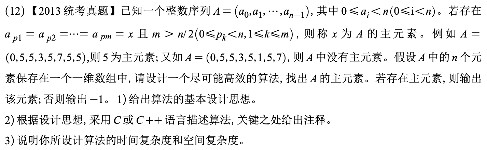

# 2013真题：数组主元素查找

#中等 #数组 #投票算法 #查找 #考研真题

## 题目信息



给定长度为 `n` 的整数数组 `A`，其中 `0 <= A[i] < n`。若某个值 `x` 出现次数 `m > n/2`，则称 `x` 为数组的主元素。要求找到主元素；若不存在，返回 `-1`。

## 示例

`A=(0,5,5,3,5,7,5,5)` 中 `5` 出现 5 次，超过长度 8 的一半，因此主元素为 `5`。`A=(0,5,5,3,5,1,5,7)` 中没有元素出现超过 4 次，返回 `-1`。

## 直接解：枚举候选并计数

依次把每个数组元素作为候选值，扫描整个数组统计它出现的次数。若某个候选值出现次数超过 `n/2`，立即返回它；全部候选都失败时返回 `-1`。

```c
int majorityBrute(int A[], int n) {
    int i, j;

    for (i = 0; i < n; i++) {
        int count = 0;
        for (j = 0; j < n; j++) {
            if (A[j] == A[i]) {
                count++;
            }
        }
        if (count > n / 2) {
            return A[i];
        }
    }
    return -1;
}
```

## 优化解：Boyer–Moore 投票

主元素如果存在，就算与其他所有元素配对抵消，仍会剩下至少一个。维护候选值 `candidate` 和抵消计数 `count`：相同则加一，不同则减一，计数归零时更换候选。

投票过程只能得到“可能的候选”，最后必须再次验证其出现次数是否超过 `n/2`。

## 示例推演

扫描 `0,5,5,3,5,7,5,5`：候选在遇到不同元素时抵消，在计数归零后更换。扫描结束后候选为 `5`，再次统计得到 5 次，大于 4，因此返回 `5`。

## 代码实现

```c
int majority(int A[], int n) {
    int candidate = 0;
    int count = 0;
    int i;
    int verify = 0;

    if (n <= 0) {
        return -1;
    }

    for (i = 0; i < n; i++) {
        if (count == 0) {
            candidate = A[i];
            count = 1;
        } else if (A[i] == candidate) {
            count++;
        } else {
            count--;
        }
    }

    for (i = 0; i < n; i++) {
        if (A[i] == candidate) {
            verify++;
        }
    }
    return verify > n / 2 ? candidate : -1;
}
```

## 正确性说明

投票阶段每次删除一对不同元素，不会改变主元素是否超过其他元素总数的事实。若主元素存在，抵消完成后留下的候选必然是主元素；若不存在，候选只是一个待验证值。第二次扫描验证了出现次数，因此返回结果正确。

## 复杂度分析

- **时间复杂度：** `O(n)`，投票和验证各扫描一次。
- **空间复杂度：** `O(1)`。

## 易错点

1. 投票结束后的候选不一定是真正主元素，必须再次验证。
2. 主元素条件是严格大于 `n/2`，等于 `n/2` 不满足。
3. 计数归零时应先更换候选，再继续扫描。

