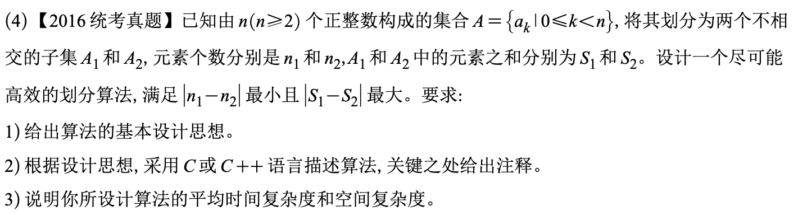

# 2016真题：集合的平衡划分

#中等 #数组 #排序 #贪心 #考研真题

## 题目信息



给定由 `n` 个正整数组成的集合 `A`，将它划分为两个不相交子集 `A1` 和 `A2`。要求先使 `|n1-n2|` 最小，再在此条件下使 `|S1-S2|` 最大，其中 `n1、n2` 是元素个数，`S1、S2` 是元素和。

## 示例

由于 `n1+n2=n`，元素个数差的最小值为 `0`（`n` 为偶数）或 `1`（`n` 为奇数）。因此只需考虑两个规模尽可能接近的子集。

## 直接解：枚举所有平衡子集

令 `k=n/2`，枚举所有包含 `k` 个元素的子集，计算它与补集的和之差并取最大值。该方法直接对应题意，但组合数量可能很大。

```c
int absInt(int x) {
    return x < 0 ? -x : x;
}

void enumeratePartition(
    int A[], int n, int k, int start, int depth,
    int chosenSum, int totalSum, int *best
) {
    int i;

    if (depth == k) {
        int diff = absInt(totalSum - 2 * chosenSum);
        if (diff > *best) {
            *best = diff;
        }
        return;
    }

    for (i = start; i <= n - (k - depth); i++) {
        enumeratePartition(A, n, k, i + 1, depth + 1,
                           chosenSum + A[i], totalSum, best);
    }
}

int balancedPartitionBrute(int A[], int n) {
    int i;
    int totalSum = 0;
    int best = 0;

    for (i = 0; i < n; i++) {
        totalSum += A[i];
    }
    enumeratePartition(A, n, n / 2, 0, 0, 0, totalSum, &best);
    return best;
}
```

时间复杂度约为 `O(C(n,n/2))`，空间复杂度为 `O(n)`（递归深度）。

## 优化解：排序后取最小的一半

先证明规模：当 `n` 为偶数，两边各取 `n/2` 个；当 `n` 为奇数，两边取 `n/2` 与 `n/2+1` 个。

由于所有元素为正数，为了最大化两组和的差，应将较小的 `n/2` 个元素放入一组，其余元素放入另一组。先排序，再计算两部分和即可。

## 示例推演

排序后记为 `a0<=a1<=...<=a(n-1)`。取前 `n/2` 个元素作为较小组，剩余元素作为另一组。两组元素数量差已经最小；正数条件保证两组和的差达到最大。

## 代码实现

```c
void quickSort(int A[], int left, int right) {
    int i = left;
    int j = right;
    int pivot = A[(left + right) / 2];
    int temp;

    while (i <= j) {
        while (A[i] < pivot) i++;
        while (A[j] > pivot) j--;
        if (i <= j) {
            temp = A[i];
            A[i] = A[j];
            A[j] = temp;
            i++;
            j--;
        }
    }
    if (left < j) quickSort(A, left, j);
    if (i < right) quickSort(A, i, right);
}

int balancedPartition(int A[], int n) {
    int i;
    int total = 0;
    int first = 0;

    for (i = 0; i < n; i++) {
        total += A[i];
    }
    quickSort(A, 0, n - 1);
    for (i = 0; i < n / 2; i++) {
        first += A[i];
    }
    return total - 2 * first;
}
```

## 正确性说明

元素个数差的最小值要求两组规模分别为 `floor(n/2)` 和 `ceil(n/2)`。固定取 `floor(n/2)` 个元素作为第一组时，另一组和第一组的差为 `total-2*S1`。因为元素均为正数且已排序，`S1` 取最小的前 `floor(n/2)` 个元素时，该差最大。

## 复杂度分析

- **时间复杂度：** `O(n log n)`，主要开销是排序。
- **空间复杂度：** `O(log n)`，来自快速排序递归栈；不计输入数组。

## 易错点

1. 必须先满足元素个数差最小，再比较元素和差。
2. 正整数条件是“取最小的一半”成立的关键。
3. `n` 为奇数时两组大小不同，不能强行平均分配。

