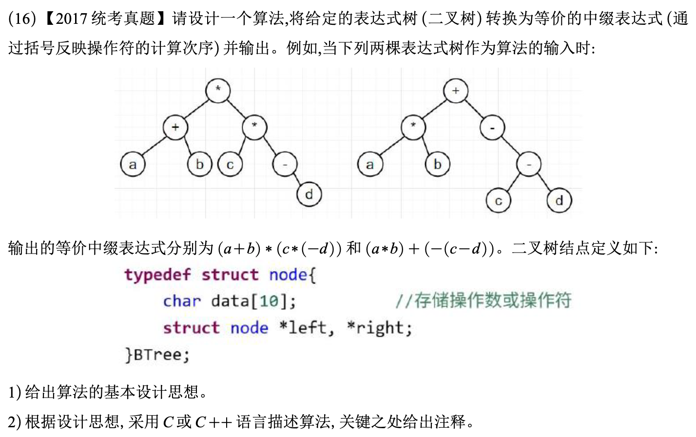

# 2017真题：表达式树转换为中缀表达式

#中等 #二叉树 #表达式树 #递归 #考研真题

## 题目信息



给定一棵表达式树，叶结点保存操作数，非叶结点保存运算符。要求将表达式树转换为等价的中缀表达式并输出。树中可能出现一元负号。

## 示例

图中第一棵树输出为 `(a+b)*(c*(-d))`，第二棵树输出为 `(a*b)+(-(c-d))`。括号用于保证原表达式树的运算顺序。

## 直接解：所有二元运算都加括号

对表达式树做递归中序遍历：叶结点直接输出；一元运算输出运算符和子表达式；二元运算在左右子表达式外统一加括号。

```c
typedef struct node {
    char data[10];
    struct node *left;
    struct node *right;
} BTree;

void printInfixBrute(BTree *root) {
    if (root == NULL) {
        return;
    }
    if (root->left == NULL && root->right == NULL) {
        printf("%s", root->data);
    } else if (root->left == NULL) {
        printf("(-");
        printInfixBrute(root->right);
        printf(")");
    } else {
        printf("(");
        printInfixBrute(root->left);
        printf("%s", root->data);
        printInfixBrute(root->right);
        printf(")");
    }
}
```

这种方法不需要判断运算符优先级，输出一定保持原树的计算顺序。

## 优化解：按运算符优先级添加必要括号

为 `+、-、*、/` 设定优先级，只有子表达式优先级低于父运算，或同级运算可能改变结合顺序时才加括号。这样可以减少冗余括号，但遍历的渐进复杂度不变。

## 示例推演

访问第一棵树的根 `*` 时，先递归输出左子树 `(a+b)`，再输出 `*`，最后输出右子树 `(c*(-d))`，得到完整中缀表达式。

## 代码实现

```c
int precedence(const char op[]) {
    if (op[0] == '+' || op[0] == '-') return 1;
    if (op[0] == '*' || op[0] == '/') return 2;
    return 3;
}

void printInfix(BTree *root, int parentPriority, int isRight) {
    int currentPriority;
    int needParentheses;

    if (root == NULL) return;
    if (root->left == NULL && root->right == NULL) {
        printf("%s", root->data);
        return;
    }
    currentPriority = precedence(root->data);
    needParentheses = currentPriority < parentPriority;
    if (isRight && currentPriority == parentPriority
        && (root->data[0] == '-' || root->data[0] == '/')) {
        needParentheses = 1;
    }

    if (needParentheses) printf("(");
    if (root->left == NULL) {
        printf("-");
        printInfix(root->right, currentPriority, 1);
    } else {
        printInfix(root->left, currentPriority, 0);
        printf("%s", root->data);
        printInfix(root->right, currentPriority, 1);
    }
    if (needParentheses) printf(")");
}
```

## 正确性说明

递归访问顺序保持左子树、根运算符、右子树的相对顺序。直接解统一加括号，因此不会改变结合顺序；优化解仅省略不会改变优先级和结合方向的括号，所以两种输出都与原表达式树等价。

## 复杂度分析

- **时间复杂度：** `O(n)`，每个结点访问一次。
- **空间复杂度：** `O(h)`，来自递归调用栈。

## 易错点

1. 一元负号只有一个孩子，不能按普通二元减法输出。
2. 不能简单地做中序遍历后删除所有括号，否则可能改变运算顺序。
3. 叶结点是操作数，非叶结点才是运算符。

