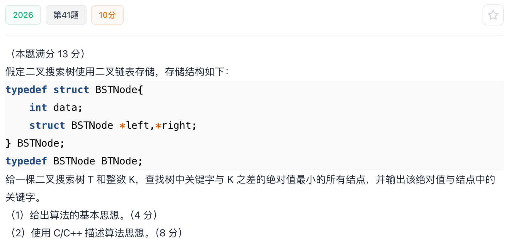

# 2026真题：二叉搜索树中查找最接近 K 的结点

#中等 #二叉搜索树 #查找 #双指针思想 #考研真题

## 题目信息



给定一棵二叉搜索树和整数 `K`，查找树中关键字与 `K` 的差的绝对值最小的所有结点，并输出这个最小绝对值以及对应的关键字。

## 示例

二叉搜索树的中序序列有序。若 `K` 不在树中，最接近它的结点只可能是查找路径上最后遇到的前驱或后继；若 `K` 恰好存在，最小绝对值为 `0`。

## 直接解：遍历全部结点

先遍历整棵树求最小绝对值，再遍历一次输出所有距离等于最小值的关键字。该方法不依赖二叉搜索树性质，适用于一般二叉树。

```c
typedef struct BSTNode {
    int data;
    struct BSTNode *left;
    struct BSTNode *right;
} BSTNode;

long long distance(int value, int K) {
    long long d = (long long)value - K;
    return d < 0 ? -d : d;
}

void findMinDistance(BSTNode *root, int K, long long *best) {
    if (root == NULL) return;
    {
        long long current = distance(root->data, K);
        if (current < *best) *best = current;
    }
    findMinDistance(root->left, K, best);
    findMinDistance(root->right, K, best);
}

void printClosestBrute(BSTNode *root, int K, long long *best) {
    if (root == NULL) return;
    if (distance(root->data, K) == *best) {
        printf("%d ", root->data);
    }
    printClosestBrute(root->left, K, best);
    printClosestBrute(root->right, K, best);
}

void closestBrute(BSTNode *root, int K) {
    long long best = 9223372036854775807LL;
    findMinDistance(root, K, &best);
    printf("distance=%lld, keys=", best);
    printClosestBrute(root, K, &best);
}
```

时间复杂度为 `O(n)`，空间复杂度为 `O(h)`。

## 优化解：利用前驱和后继定位

沿 BST 查找 `K`。向左走时，当前结点可能成为后继；向右走时，当前结点可能成为前驱。查找结束后只需比较前驱和后继，最小值对应的结点就是答案。

若 `K` 恰好存在，直接返回该结点；若前驱和后继距离相等，则两个关键字都应输出。

## 示例推演

查找 `K` 时，当前结点小于 `K` 就记录为前驱并进入右子树；当前结点大于 `K` 就记录为后继并进入左子树。路径结束后比较两个候选距离即可。

## 代码实现

```c
void closest(BSTNode *root, int K) {
    BSTNode *p = root;
    BSTNode *predecessor = NULL;
    BSTNode *successor = NULL;
    long long best;

    while (p != NULL) {
        if (p->data == K) {
            printf("distance=0, keys=%d\n", K);
            return;
        }
        if (p->data < K) {
            predecessor = p;
            p = p->right;
        } else {
            successor = p;
            p = p->left;
        }
    }

    if (predecessor == NULL && successor == NULL) return;
    if (predecessor == NULL) {
        best = distance(successor->data, K);
        printf("distance=%lld, keys=%d\n", best, successor->data);
    } else if (successor == NULL) {
        best = distance(predecessor->data, K);
        printf("distance=%lld, keys=%d\n", best, predecessor->data);
    } else {
        long long left = distance(predecessor->data, K);
        long long right = distance(successor->data, K);
        best = left < right ? left : right;
        printf("distance=%lld, keys=", best);
        if (left == best) printf("%d ", predecessor->data);
        if (right == best) printf("%d", successor->data);
        printf("\n");
    }
}
```

## 正确性说明

BST 查找路径上的最后一个小于 `K` 的结点是最大前驱，最后一个大于 `K` 的结点是最小后继。中序序列中，`K` 的最近元素只能是这两个相邻候选；比较它们的距离即可得到全树最小值，并输出所有并列候选。

## 复杂度分析

- **时间复杂度：** `O(h)`，只沿一条查找路径访问结点。
- **空间复杂度：** `O(1)`。

## 易错点

1. 小于 `K` 更新前驱，大于 `K` 更新后继，方向不能写反。
2. 前驱或后继不存在时要单独处理。
3. 两个候选距离相等时必须全部输出。

